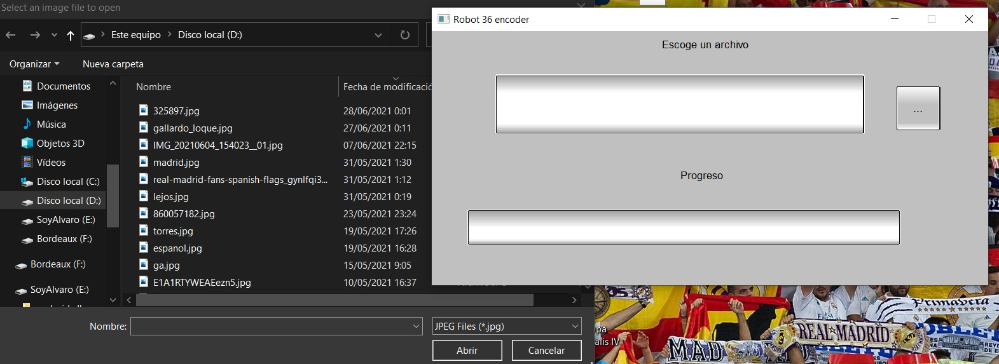

# Robot36_Encoder
This utility is written in RustLang powered by fltk-rs GUI engine. Its main object is to encode small iamge into Wave file (Resolution < 750 * 750), which will protect your communication freedom!
### Screenshots:
